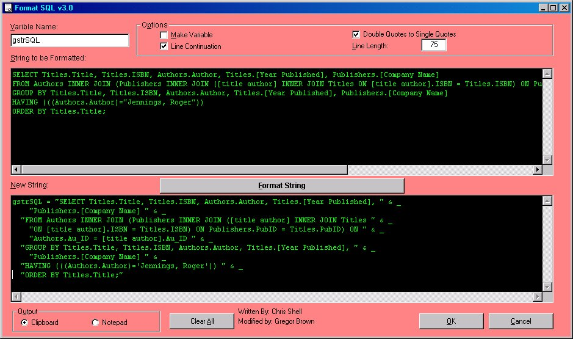



## SQL Formatter

### Description

Formats SQL strings with quotes and line breaks for use in VB.

This was a project that was submitted by another user that I have modified. I have added in the ability to update which SQL clauses will cause a line break, using a txt file. Also I have updated the SQLVarPos so that it uses an array for position location of key words.

This also has better tab order and an auto-tab so you are ready to copy your formatted string as soon as you select "Format String".
 
### More Info
 

             |
---                |---
**Submitted On**   |2001-08-24 12:19:02
**By**             |[Gregor Brown](https://github.com/Planet-Source-Code/PSCIndex/blob/master/ByAuthor/gregor-brown.md)
**Level**          |Intermediate
**User Rating**    |5.0 (40 globes from 8 users)
**Compatibility**  |VB 6\.0
**Category**       |[String Manipulation](https://github.com/Planet-Source-Code/PSCIndex/blob/master/ByCategory/string-manipulation__1-5.md)
**World**          |[Visual Basic](https://github.com/Planet-Source-Code/PSCIndex/blob/master/ByWorld/visual-basic.md)
**Archive File**   |[SQL Format252808242001\.zip](https://github.com/Planet-Source-Code/gregor-brown-sql-formatter__1-26612/archive/master.zip)

